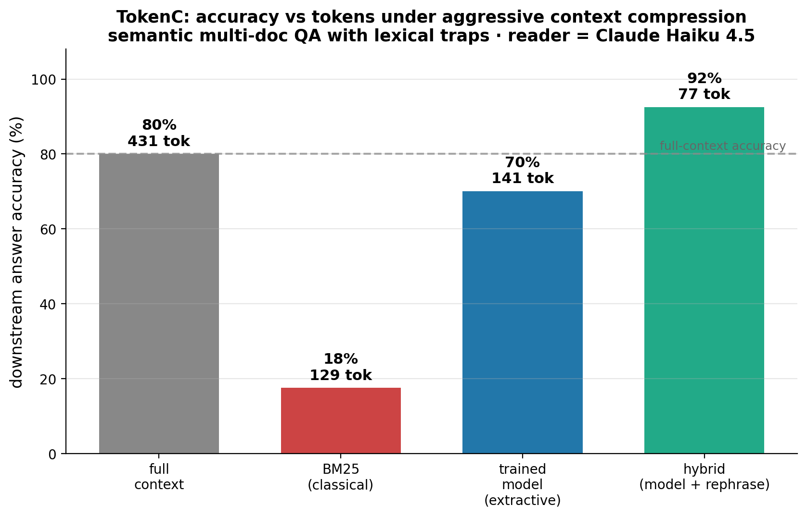

# TokenC — distill Claude's context compression into a tiny model

**The Token Company Compression Challenge.** Cut the tokens you send an LLM while preserving — and with the hybrid, *improving* — answer quality, by distilling **Claude's relevance judgment** into a small, local **keep/drop token classifier** (the LLMLingua-2 recipe, with Claude as the teacher).



### Headline result (from `demo.ipynb`, measured)

Semantic multi-doc QA with lexical-trap distractors, downstream reader = **Claude Haiku 4.5**:

| approach | accuracy | tokens |
|---|---|---|
| full context | 80% | 431 |
| BM25 (classical) @ 20% keep | 18% | 129 |
| trained model (extractive) @ 20% keep | 70% | 141 |
| **hybrid (model + rephrase)** | **92%** | **77** |

Two results:

- The **extractive model stays robust** under aggressive compression — 70% accuracy vs BM25's 18% at the *same* token budget. The rare-token lexical traps fool BM25 into dropping the answer; the model distilled from Claude keeps it.
- The **hybrid hits both halves of the challenge at once**: the trained model does the cheap local bulk cut, then a Haiku **densifier** rephrases only the survivors. Result: **92% accuracy at 77 tokens — higher than full context (80%) at ~18% of the tokens.** Denoising the context before the reader sees it removes the distractors that trip it up.

The 66M-param compressor trains in **~10 seconds on a MacBook (MPS)**.

---

## Why a learned compressor beats classical

BM25 ranks sentences by surface-word overlap. The moment the query and the answer don't share words — *"Where is X **based**?"* answered by *"X **runs everything out of** Helsinki"* — and the context is full of lexical traps (*"X **based** its culture on remote-first work"*), BM25 spends its budget on the traps and **drops the answer**. The model, trained to imitate which sentences **Claude** says are needed, learns the meaning-level mapping and keeps the answer.

## Extractive vs hybrid

The trained model is **extractive** — it scores each sentence's keep-probability (query-conditioned) and deletes to a budget. It can only delete, never reword, which is a feature: one cheap forward pass, no hallucination, exact values preserved.

The **hybrid** adds an abstractive last mile: after the extractive bulk cut, a Haiku densifier rewrites the surviving sentences into dense facts (values kept verbatim). It runs on a small, already-relevant input, so it's cheap and has little room to invent — and the cost math strongly favors it when the downstream reader is a larger model than the densifier.

---

## How it works

```
 (context, query)
        │  distill.py
        ▼  Claude (teacher) picks the sentences needed to answer the query
            → per-token KEEP/DROP labels  (data/*.jsonl)
        │  train_compressor.py
        ▼  DistilBERT (student) fine-tuned as a query-aware keep/drop classifier
            → compressor_model/  (class-weighted loss; KEEP is ~2%)
        │  neural.py
        ▼  rank sentences by mean KEEP-probability, fill to a token budget
            → extractive compress(); compress_hybrid() adds a densify() last mile
        │  tokenc.py (eval harness)
        ▼  full vs BM25 vs model vs hybrid → accuracy / tokens / $  → demo.ipynb
```

- **Teacher labeling** (`distill.py`): Claude sees the context as a numbered sentence list and returns the indices needed — exact token-label alignment, no fuzzy matching. Mixed lexical + semantic slices; seeds disjoint from the eval set.
- **Student** (`train_compressor.py`): `AutoModelForTokenClassification` (default `distilbert-base-uncased`; swap with `--backbone`). A bidirectional encoder is the right architecture for keep/drop — each token sees both directions. Class-weighted loss because KEEP is rare; we treat the model as a ranker, not a 0.5-threshold classifier.
- **Inference** (`neural.py`): per-sentence KEEP-probability → rank → fill to budget → re-emit in order. `compress_hybrid()` adds the densify pass. Sentence scores are ratio-independent and disk-cached, so a whole Pareto sweep reuses them.
- **Eval** (`tokenc.py`): controllable multi-doc QA with distractors; Claude as the downstream reader; objective substring grading; every LLM call disk-cached so the demo re-runs instantly.

---

## Files

| file | what |
|---|---|
| `tokenc.py` | engine: BM25 baseline, budget controller, benchmark generator, eval harness, `densify`, pricing, caching |
| `distill.py` | generate KEEP/DROP labels from Claude (`--offline` for an API-free dry run) |
| `train_compressor.py` | fine-tune the keep/drop classifier (`--smoke` for a fast pipeline+timing check) |
| `neural.py` | load the trained model; `compress` (extractive) and `compress_hybrid` (extractive + rephrase) |
| `make_figures.py` | render `performance.png` and `pareto.png` |
| `build_notebook.py` | regenerate `demo.ipynb` |
| `demo.ipynb` | the story + charts + interactive keep-rate slider (pre-executed) |
| `smoke_test.py` | offline sanity checks (no API key) |

---

## Quickstart

```bash
bash setup.sh                                   # venv + deps + Jupyter kernel
echo 'ANTHROPIC_API_KEY=sk-ant-...' > .env      # auto-loaded by every script

./.venv/bin/python distill.py --n 240           # distill labels from Claude  (~5 min, cached)
./.venv/bin/python train_compressor.py          # train the model             (~10 s on MPS)
./.venv/bin/python make_figures.py              # render performance.png / pareto.png
./.venv/bin/jupyter notebook demo.ipynb         # open the demo
```

The notebook ships **pre-executed** — open it to see the charts immediately; re-run is instant (cached). The **keep-rate slider** cell is the booth demo: drag it and watch tokens & cost fall while the answer stays correct, then flip to BM25 to watch it break.

---

## Product framing

A **drop-in proxy**: point your Anthropic `base_url` at TokenC; we compress every prompt's context before it hits the model — fewer input tokens, same or better answers, one line of config. The extractive compressor is a small model you run locally; the hybrid adds a cheap rephrase pass when you want the last mile.

---

## Honest notes

- The benchmark is **synthetic and controllable** by design — it lets us dial the exact regime (lexical traps, compression budget) where classical methods fail and a learned one wins, with objective grading. The methods are content-agnostic and run on any text (try the slider on your own).
- The extractive model *maintains* quality under aggressive compression; the **hybrid measurably *improves* over full-context accuracy here (92% vs 80%)** by denoising before the reader. The rephrase is a small extra LLM call on already-pruned input — the cost trade-off favors it when the reader is a bigger model than the densifier.
- Models/pricing from the current Claude lineup (Haiku 4.5 $1/$5, Sonnet 4.6 $3/$15, Opus 4.8 $5/$25 per 1M in/out). Token counts use Anthropic's own counter / real API `usage`, never tiktoken.
